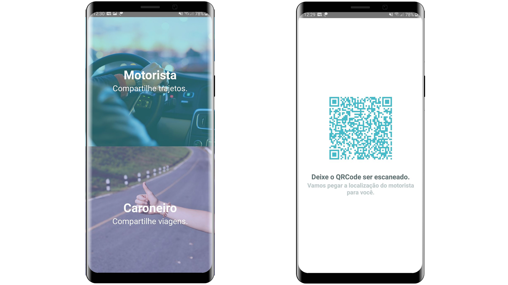
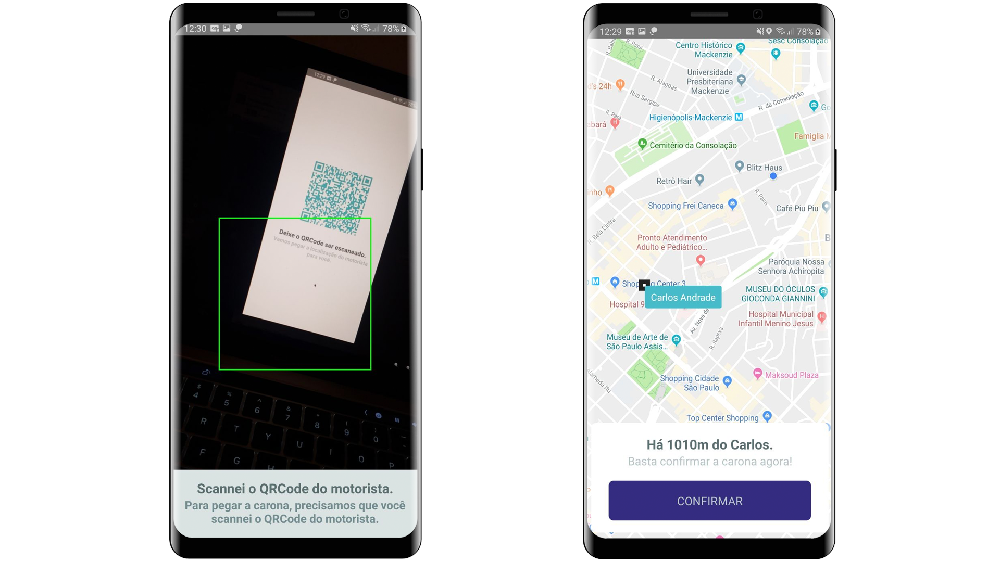

<p align="center">
  <a href="https://rocketseat.com.br">
    
  </a>

  <h3 align="center">Bynd App Challenge</h3>
</p>

---



<br />



### Run locally

```
npm start

react-native run-android
```
